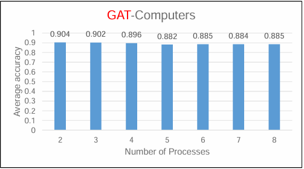

## Horovod 기반 분산 GCN 학습에서 그래프 파티셔닝 특성 분석
### - Paper
__강소연__, 이상훈, 문양세, "Horovod 기반 분산 GCN 학습에서 그래프 파티셔닝 특성 분석", 한국컴퓨터종합학술대회, pp. 161-163, 2024.
### - 기술스택
Horovod, PyTorch, PyTorch Geometric

## 1. Horovod 분산 프레임워크 동작 과정
__(1) Graph Partitioning__ 
- METIS로 그래프 데이터 파티셔닝 수행 -> 서브그래프 구성 

__(2) Subgraph Assignment__ 
- 서브그래프를 각 프로세스에 할당 
  
__(3) Distributed Training__ 
- 할당받은 서브그래프로 GCN 분산 학습 수행 
- 각 서버의 프로세스는 모델을 독립적으로 학습 

__(5) Synchronization__ 
- 각 서버에서 파라미터 계산 후, All-Reduce 연산 수행 
- 모든 서버의 모델이 동일한 파라미터로 업데이트 -> 모델의 일관성 보장 

## 2. 그래프 파티셔닝 특성
__(1) 엣지 컷__ 
- 그래프 데이터는 노드와 노드 사이를 잇는 엣지로 구성 
- 파티셔닝 수행 후, 파티션 간 엣지가 삭제되는 엣지 컷 발생  

__(2) 차수(degree)에 따른 엣지 컷__ 
- 고 차수(high degree) 그래프 데이터일수록 엣지 컷 많이 발생 
- 엣지 컷 -> 정보 손실 -> 학습 성능에 영향 

## 3. 차수와 클래스 수에 따른 분산 학습 결과
__(1) 차수↑ 클래스↑ 데이터셋__ 

 
 
__(2) 차수↑ 클래스↓ 데이터셋__ 

 
 
__(3) 차수↓ 클래스↑ 데이터셋__ 

 
 
__(4) 차수↓ 클래스↓ 데이터셋__ 

 
 

## 4. 추가 실험
__(1) 클래스를 2개로 클러스터링 후 분산 학습__
- 3-(1)의 Amazon(Com) 데이터셋의 클래스를 클러스터링을 사용해 2개로 축소 
- 클래스 수 축소 -> 학습 정확도 유지 

 
 

**(2) GAT 분산 학습**
- 3-(1)의 Amazon(Com) 데이터셋을 GAT로 분산 학습 
- GAT는 Transformer의 Attention을 적용한 모델 
- 그래프의 노드간 가중치 반영 가능 -> 보다 정확한 학습 가능 -> 분산 학습 시 정확도 유지 

 
 

## 5. 결론
- 본 논문은 그래프 데이터의 특성과 분산 학습 성능의 관계를 분석
- 실험 결과, 데이터 특성(차수, 클래스 수)에 따른 GNN 모델 선택을 위한 기초 자료로 활용될 것을 기대

